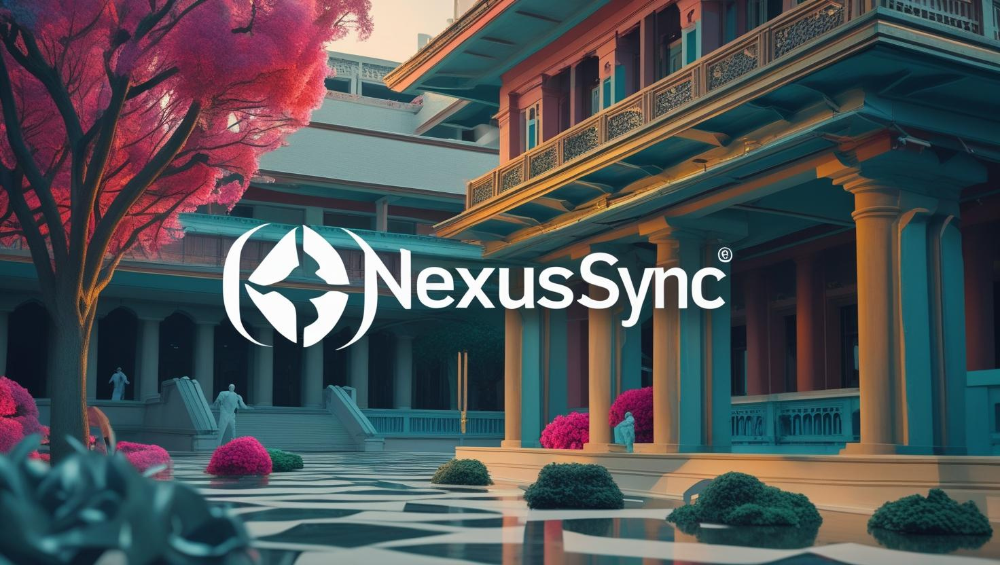
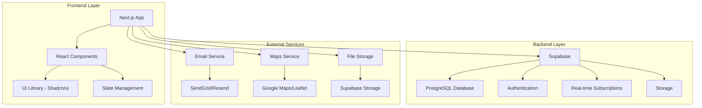
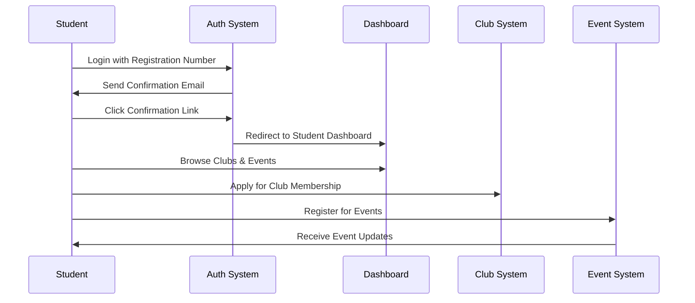
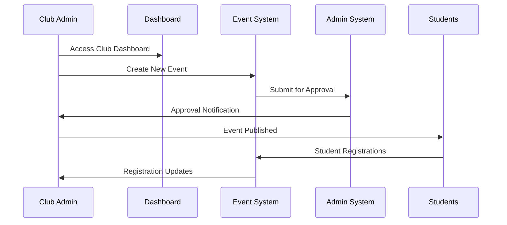
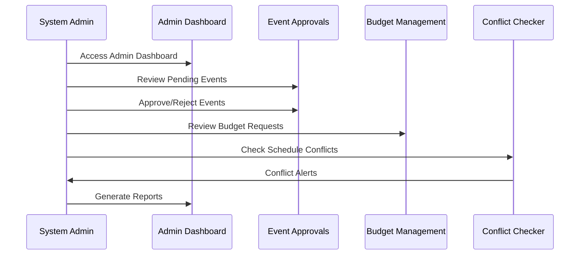

# 🚀 NexusSync - Hackathon Project

<div align="center">
  
  
  **A Comprehensive Campus Club Management & Student Engagement Platform**
  
  [](https://nextjs.org/)
  [](https://reactjs.org/)
  [](https://www.typescriptlang.org/)
  [](https://tailwindcss.com/)
  [](https://supabase.com/)
  [](LICENSE)
  
  [](https://github.com/PrayatshuMisra/hackathon_nexussync/stargazers)
  [](https://github.com/PrayatshuMisra/hackathon_nexussync/network)
  [](https://github.com/PrayatshuMisra/hackathon_nexussync/issues)
  [](https://github.com/PrayatshuMisra/hackathon_nexussync/pulls)
</div>

---

## 📋 Table of Contents

- [🎯 Project Overview](#-project-overview)
- [✨ Key Features](#-key-features)
- [🏗️ Architecture & Tech Stack](#️-architecture--tech-stack)
- [🚀 Quick Start](#-quick-start)
- [⚙️ Setup Instructions](#️-setup-instructions)
- [📦 Dependencies](#-dependencies)
- [👥 Team Details](#-team-details)
- [🔄 Workflow & System Architecture](#-workflow--system-architecture)
- [🔗 Important Links](#-important-links)
- [🤝 Contributing](#-contributing)
- [📄 License](#-license)

---

## 🎯 Project Overview

**NexusSync** is a comprehensive campus club management and student engagement platform developed for colleges during the hackathon. The platform serves as a unified ecosystem for managing student clubs, events, recruitment, and fostering meaningful connections between students and campus organizations.

### 🎯 Mission
To revolutionize campus club management by providing a seamless, feature-rich platform that enhances student engagement, streamlines administrative processes, and creates a vibrant campus community.

### 🎯 Vision
To become the go-to platform for educational institutions seeking to digitize and optimize their club management systems while fostering student leadership and community building.

---

## ✨ Key Features

### 🎓 **Multi-Role User System**
- **Students**: Browse clubs, apply for memberships, attend events, track applications
- **Club Members**: Manage club content, events, recruitment campaigns
- **Club Admins**: Oversee club operations, member management, budget tracking
- **System Admins**: Platform-wide management, approvals, analytics

### 🏢 **Club Management**
- 📊 **Club Analytics**: Real-time engagement metrics, member growth, event statistics
- 🎨 **Content Management**: Rich media posts, announcements, achievements
- 👥 **Member Management**: Application processing, role assignments, member directories
- 💰 **Budget Tracking**: Expense management, budget requests, financial reporting

### 📅 **Event Management**
- 🎪 **Event Creation**: Rich event details, venue booking, capacity management
- ✅ **Approval Workflow**: Multi-level approval system with admin oversight
- 📍 **Campus Map Integration**: Interactive venue mapping and navigation
- 🎫 **Registration System**: Event registration, attendance tracking, certificates

### 🎯 **Recruitment & Engagement**
- 📝 **Application Portal**: Streamlined application process with portfolio uploads
- 🎮 **Interactive Quizzes**: Skill assessment and engagement tools
- 🏆 **Achievement System**: Gamified engagement with badges and rewards
- 📱 **Real-time Notifications**: Push notifications, email alerts, in-app messaging

### 📊 **Analytics & Reporting**
- 📈 **Dashboard Analytics**: Comprehensive insights for all user types
- 📋 **Conflict Detection**: Automated scheduling conflict identification
- 📊 **Performance Metrics**: Engagement rates, growth tracking, satisfaction scores
- 📄 **Report Generation**: Automated report creation and export

---

## 🏗️ Architecture & Tech Stack

### 🎨 **Frontend Technologies**
- **[Next.js 15.2.4](https://nextjs.org/)** - React framework with App Router
- **[React 19](https://reactjs.org/)** - UI library with latest features
- **[TypeScript 5](https://www.typescriptlang.org/)** - Type-safe development
- **[Tailwind CSS 3.4.17](https://tailwindcss.com/)** - Utility-first CSS framework
- **[Radix UI](https://www.radix-ui.com/)** - Accessible component primitives
- **[Framer Motion](https://www.framer.com/motion/)** - Animation library
- **[Lucide React](https://lucide.dev/)** - Beautiful icon library

### 🗄️ **Backend & Database**
- **[Supabase](https://supabase.com/)** - Backend-as-a-Service with PostgreSQL
- **[PostgreSQL](https://www.postgresql.org/)** - Relational database
- **[Row Level Security (RLS)](https://supabase.com/docs/guides/auth/row-level-security)** - Data security
- **[Real-time Subscriptions](https://supabase.com/docs/guides/realtime)** - Live updates

### 🎯 **UI/UX Components**
- **[Shadcn/ui](https://ui.shadcn.com/)** - Re-usable component library
- **[React Hook Form](https://react-hook-form.com/)** - Form management
- **[Zod](https://zod.dev/)** - Schema validation
- **[Sonner](https://sonner.emilkowal.ski/)** - Toast notifications
- **[Recharts](https://recharts.org/)** - Data visualization
- **[React Leaflet](https://react-leaflet.js.org/)** - Interactive maps

### 🔧 **Development Tools**
- **[ESLint](https://eslint.org/)** - Code linting
- **[PostCSS](https://postcss.org/)** - CSS processing
- **[Autoprefixer](https://autoprefixer.github.io/)** - CSS vendor prefixes
- **[pnpm](https://pnpm.io/)** - Fast package manager

---

## 🚀 Quick Start

### Prerequisites
- **Node.js** 18+ 
- **pnpm** (recommended) or npm
- **Git**
- **Supabase Account**

### 🏃‍♂️ Quick Installation

```bash
# Clone the repository
git clone https://github.com/PrayatshuMisra/hackathon_nexussync.git
cd hackathon_nexussync

# Install dependencies
pnpm install

# Set up environment variables
cp .env.example .env.local

# Start development server
pnpm dev
```

Visit `http://localhost:3000` to see the application!

---

## ⚙️ Setup Instructions

### 1. 🔐 Environment Configuration

Create a `.env.local` file in the root directory:

```env
# Supabase Configuration
NEXT_PUBLIC_SUPABASE_URL=your_supabase_project_url
NEXT_PUBLIC_SUPABASE_ANON_KEY=your_supabase_anon_key

# Application Configuration
NEXT_PUBLIC_BASE_URL=http://localhost:3000

# Email Configuration (Optional)
SENDGRID_API_KEY=your_sendgrid_api_key
RESEND_API_KEY=your_resend_api_key
```

### 2. 🗄️ Database Setup

#### Option A: Using Supabase Dashboard
1. Create a new Supabase project
2. Navigate to SQL Editor
3. Run the database scripts in order:
   ```sql
   -- Run scripts/01-final-create-tables.sql
   -- Run scripts/02-seed-enhanced-data.sql
   -- Run scripts/03-email-confirmation-tables.sql
   -- Run scripts/04-fix-email-confirmation-tables.sql
   ```

#### Option B: Using Supabase CLI
```bash
# Install Supabase CLI
npm install -g supabase

# Login to Supabase
supabase login

# Initialize project
supabase init

# Start local development
supabase start

# Apply migrations
supabase db push
```

### 3. 🔧 Development Setup

```bash
# Install dependencies
pnpm install

# Run type checking
pnpm type-check

# Run linting
pnpm lint

# Build for production
pnpm build

# Start production server
pnpm start
```

### 4. 🧪 Testing

```bash
# Run tests (if configured)
pnpm test

# Run tests in watch mode
pnpm test:watch

# Run tests with coverage
pnpm test:coverage
```

### 5. 🚀 Deployment

#### Vercel Deployment (Recommended)
1. Connect your GitHub repository to Vercel
2. Configure environment variables in Vercel dashboard
3. Deploy automatically on push to main branch

#### Manual Deployment
```bash
# Build the application
pnpm build

# Export static files (if needed)
pnpm export

# Deploy to your hosting provider
```

---

## 📦 Dependencies

### 🎯 **Core Dependencies**

| Package | Version | Purpose |
|---------|---------|---------|
| `next` | `15.2.4` | React framework |
| `react` | `^19` | UI library |
| `react-dom` | `^19` | React DOM rendering |
| `typescript` | `^5` | Type safety |
| `@supabase/supabase-js` | `^2.50.2` | Backend services |

### 🎨 **UI & Styling**

| Package | Version | Purpose |
|---------|---------|---------|
| `tailwindcss` | `^3.4.17` | CSS framework |
| `@radix-ui/react-*` | Various | UI primitives |
| `lucide-react` | `^0.454.0` | Icons |
| `framer-motion` | `^12.19.1` | Animations |
| `class-variance-authority` | `^0.7.1` | Component variants |

### 📊 **Data & Forms**

| Package | Version | Purpose |
|---------|---------|---------|
| `react-hook-form` | `^7.54.1` | Form management |
| `@hookform/resolvers` | `^3.9.1` | Form validation |
| `zod` | `^3.24.1` | Schema validation |
| `recharts` | `2.15.0` | Data visualization |

### 🗺️ **Maps & Location**

| Package | Version | Purpose |
|---------|---------|---------|
| `leaflet` | `^1.9.4` | Interactive maps |
| `react-leaflet` | `^5.0.0` | React map components |
| `@react-google-maps/api` | `^2.20.7` | Google Maps integration |

### 📄 **Document Generation**

| Package | Version | Purpose |
|---------|---------|---------|
| `jspdf` | `^3.0.1` | PDF generation |
| `file-saver` | `^2.0.5` | File download |

### 🔔 **Notifications & Feedback**

| Package | Version | Purpose |
|---------|---------|---------|
| `sonner` | `^1.7.1` | Toast notifications |
| `input-otp` | `1.4.1` | OTP input components |

### 🎮 **Interactive Components**

| Package | Version | Purpose |
|---------|---------|---------|
| `embla-carousel-react` | `8.5.1` | Carousel/slider |
| `react-resizable-panels` | `^2.1.7` | Resizable panels |
| `vaul` | `^0.9.6` | Drawer components |

### 🛠️ **Development Dependencies**

| Package | Version | Purpose |
|---------|---------|---------|
| `@types/node` | `^22` | Node.js types |
| `@types/react` | `^19` | React types |
| `@types/react-dom` | `^19` | React DOM types |
| `postcss` | `^8.5` | CSS processing |
| `autoprefixer` | `^10.4.20` | CSS vendor prefixes |

---

## 👥 Team Details

### 🏆 **Development Team: RaMPage**

-Prayatshu Misra
-Rohan Mathur
-Mehran Pratap Singh Dhakray

### 🎯 **Project Mentors**

| Role | Name | Organization |
|------|------|-------------|
| **Hackathon Organiser** | ISTE | ISTE MIT Manipal |


## 🔄 Workflow & System Architecture

### 🏗️ **System Architecture Diagram**



### 🔄 **User Workflow**

#### 👨‍🎓 **Student Journey**


#### 🏢 **Club Admin Journey**


#### 👨‍💼 **System Admin Journey**


### 🗄️ **Database Schema Overview**

#### **Core Tables**
- **users** - User profiles and authentication
- **clubs** - Club information and metadata
- **events** - Event details and scheduling
- **posts** - Social media-style content
- **applications** - Club membership applications
- **notifications** - User notifications system

#### **Supporting Tables**
- **club_members** - Club membership relationships
- **event_registrations** - Event attendance tracking
- **budget_requests** - Financial management
- **conflicts** - Schedule conflict detection
- **achievements** - Gamification system

### 🔐 **Security Architecture**

#### **Authentication Flow**
1. **Registration Number Validation** - Student identity verification
2. **Email Confirmation** - Secure email-based authentication
3. **Session Management** - JWT-based session handling
4. **Role-Based Access Control** - Granular permissions system

#### **Data Protection**
- **Row Level Security (RLS)** - Database-level access control
- **Input Validation** - Zod schema validation
- **XSS Protection** - Content Security Policy
- **CSRF Protection** - Cross-Site Request Forgery prevention

---

## 🔗 Important Links

### 🌐 **Application Links**
- **Production**: [NexusSync Production](https://hackathon-nexussync.vercel.app/)

### 🛠️ **Development Resources**
- **GitHub Repository**: [hackathon_nexussync](https://github.com/PrayatshuMisra/hackathon_nexussync)
- **Issue Tracker**: [GitHub Issues](https://github.com/PrayatshuMisra/hackathon_nexussync/issues)
- **Project Board**: [GitHub Projects](https://github.com/PrayatshuMisra/hackathon_nexussync/projects)

### 📚 **Technology Documentation**
- **Next.js**: [nextjs.org/docs](https://nextjs.org/docs)
- **React**: [react.dev](https://react.dev)
- **Supabase**: [supabase.com/docs](https://supabase.com/docs)
- **Tailwind CSS**: [tailwindcss.com/docs](https://tailwindcss.com/docs)
- **Shadcn/ui**: [ui.shadcn.com](https://ui.shadcn.com)


### 📧 **Contact Information**
- **Project Lead**: prayatshumisra2005@gmail.com

---

## 🤝 Contributing

We welcome contributions from the community! Here's how you can help:

### 🚀 **Getting Started**
1. Fork the repository
2. Create a feature branch: `git checkout -b feature/amazing-feature`
3. Commit your changes: `git commit -m 'Add amazing feature'`
4. Push to the branch: `git push origin feature/amazing-feature`
5. Open a Pull Request

### 📋 **Contribution Guidelines**
- Follow the existing code style and conventions
- Add tests for new features
- Update documentation as needed
- Ensure all tests pass before submitting

### 🐛 **Reporting Issues**
- Use the GitHub issue tracker
- Provide detailed reproduction steps
- Include browser/device information
- Attach screenshots if applicable

### 💡 **Feature Requests**
- Describe the feature in detail
- Explain the use case and benefits
- Consider implementation complexity
- Discuss with the team before starting

---

### 🏛️ **Attribution**
Please include a link to this repository when using this project in your work.

---

<div align="center">
  
  **Made with ❤️ by the NexusSync Team for ISTE MIT Manipal**
  
  [](https://github.com/PrayatshuMisra/hackathon_nexussync/stargazers)
  [](https://github.com/PrayatshuMisra/hackathon_nexussync/network)
  
  **⭐ Star this repository if you found it helpful!**
  
</div> 
